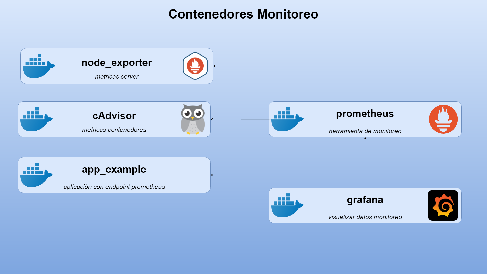

## Explicación del proyecto

PAra el siguiente proyecto vamos a crear unna imagen de docker con utilizando el Software as a service(saas) que nos ofrecen varias compañias.  

El servicio **grafana** utiliza la imagen grafana/grafana:8.0.6 y se nombra como grafana. Se reiniciará automáticamente a menos que se detenga explícitamente. Monta el volumen grafana-data en el directorio /var/lib/grafana dentro del contenedor y expone el puerto 3000 del contenedor al puerto 3000 del host.

El servicio **prometheus** utiliza la imagen prom/prometheus:v2.28.1 y se nombra como prometheus. Se reiniciará automáticamente a menos que se detenga explícitamente. Monta el archivo prometheus.yml local en /etc/prometheus/prometheus.yml dentro del contenedor y el volumen prometheus-data en el directorio /prometheus dentro del contenedor. Expone el puerto 9090 del contenedor al puerto 9090 del host. También se proporcionan varios comandos adicionales para configurar Prometheus.

El servicio **node_exporter** utiliza la imagen quay.io/prometheus/node-exporter:latest y se nombra como node_exporter. Se reiniciará automáticamente a menos que se detenga explícitamente. Expone el puerto 9100 del contenedor al puerto 9100 del host. Hay dos secciones de volúmenes comentadas: una para Linux y otra para Windows. En el caso de Windows, se montan los directorios /proc y /sys del host dentro del contenedor para obtener métricas del sistema.

El servicio **cadvisor** utiliza la imagen gcr.io/cadvisor/cadvisor:latest y se nombra como cadvisor. Se reiniciará automáticamente a menos que se detenga explícitamente. Expone el puerto 8080 del contenedor. Se montan varios directorios del host en el contenedor para recopilar métricas de uso de recursos de Docker.

El servicio **app_example** utiliza la imagen quay.io/brancz/prometheus-example-app:v0.3.0 y se nombra como app_example. Se reiniciará automáticamente a menos que se detenga explícitamente. Expone el puerto 8080 del contenedor al puerto 80 del host.

## Requisitos
- Docker
- Docker Compose

# Pasos para la Configuración de Docker Compose para Grafana, Prometheus y más

Este repositorio contiene un archivo de configuración en formato YAML para Docker Compose que te permite ejecutar varios servicios en contenedores, incluyendo Grafana, Prometheus y otras herramientas para el monitoreo y recolección de métricas.

## Requisitos

- Docker
- Docker Compose

## Uso

1. Clona este repositorio:

https://github.com/jdiegoisaza/Monitoreo_prometheus-grafana

2. Navega al directorio del repositorio:

cd Monitoreo prometheus-grafana

3. Inicia los contenedores usando Docker Compose:

docker-compose up -d

Esto iniciará los contenedores en segundo plano.

4. Accede a las siguientes URL en tu navegador:

- Grafana: [http://localhost:3000](http://localhost:3000)
- Prometheus: [http://localhost:9090](http://localhost:9090)
- Node Exporter: [http://localhost:9100](http://localhost:9100)
- Cadvisor: [http://localhost:8080](http://localhost:8080)
- App de ejemplo: [http://localhost:80](http://localhost:80)

Nota: Es posible que algunas de estas URL no estén disponibles dependiendo de los servicios que hayas configurado.

5. Puedes detener los contenedores en cualquier momento ejecutando:

docker-compose down

**Nota:** Explicacion detallada del proceso disponible en el siguiente video: https://youtu.be/mHP-Ke95Ilo